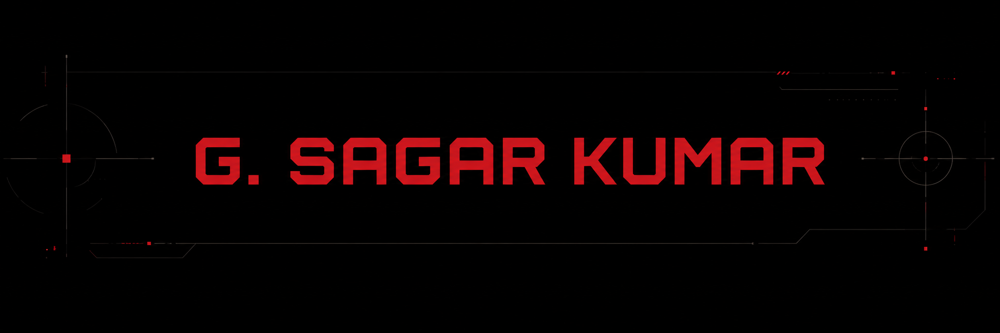
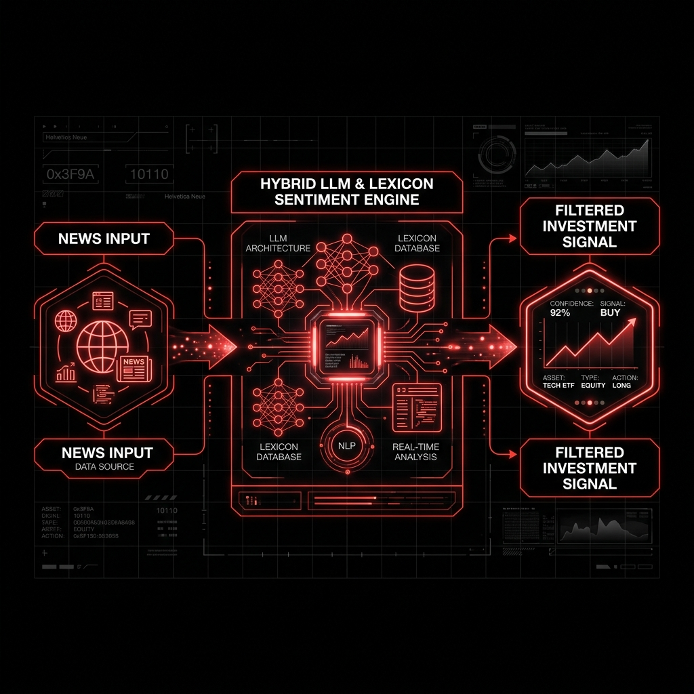
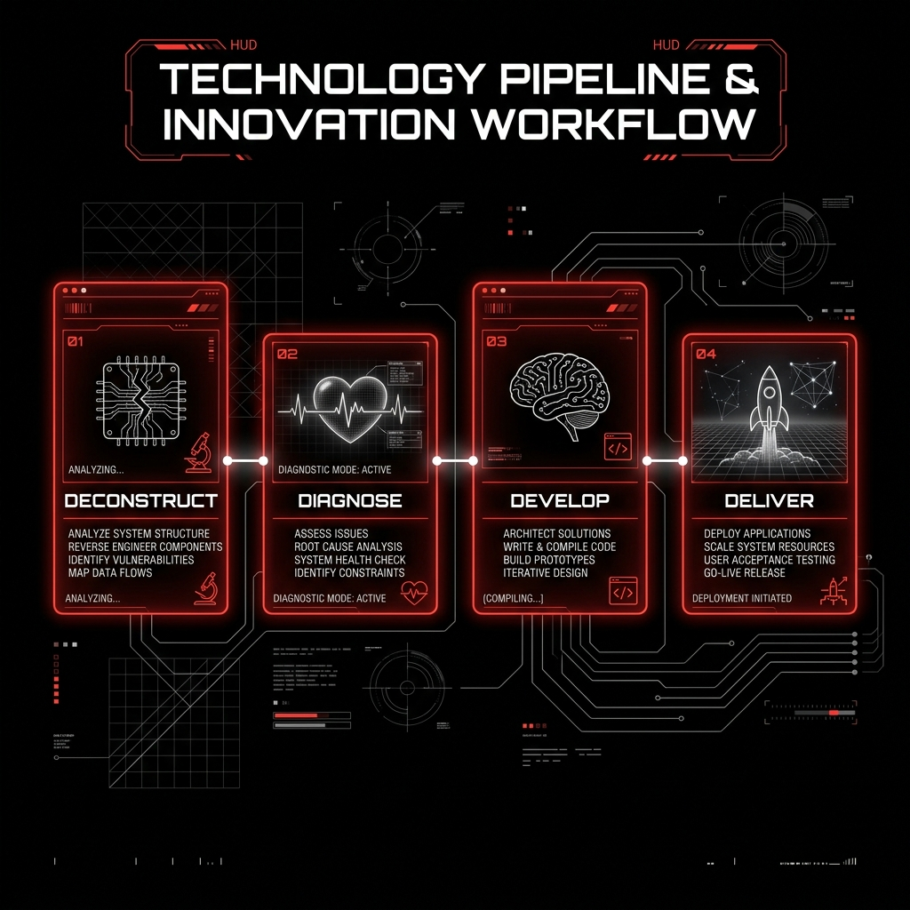

 
 

&nbsp;

&nbsp;

 

### **Frontend → Backend → LLM Systems.**
*"Beyond code, there’s human ingenuity."*

 

---

## `01` ABOUT

I'm a product-oriented software engineer and applied AI builder based in Hyderabad. I work across frontend, backend, and LLM systems, turning ambiguous ideas into functional, production-ready software.

- 🎯 **Focus:** 0 → 1 development, rapid prototyping, UX-driven systems, and agentic LLM workflows.
- 🎓 **Education:** B.Tech CSE, VJIT — Class of 2027.
- 💡 **Philosophy:** Building software that makes sense to both machines and humans— because great engineering goes beyond code.

 

---

## `02` TECH STACK

  

| Category | Core Technologies |
| :--- | :--- |
| **Languages** | `Python` `TypeScript` `JavaScript` `Java` `SQL` |
| **Frontend** | `React` `Next.js` `Tailwind CSS` `HTML5/CSS3` |
| **Backend** | `FastAPI` `PostgreSQL` `Redis` `SQLite` `REST APIs` |
| **AI / LLM** | `LangChain` `LangGraph` `ChromaDB` `Groq` `Prompt Engineering` |
| **Tooling & DevOps** | `Git` `Docker` `Postman` `Vercel` `Playwright` |

 

---

## `03` SELECTED WORK

 

  <table border="0">
    <tr>
      <td align="center" width="50%">
        
         
        <b>Nexus AI Architecture Engine</b>
      </td>
      <td align="center" width="50%">
        
         
        <b>Prompt Kakusei Pipeline</b>
      </td>
    </tr>
  </table>

 

| Project | Description | Tech Stack | Links |
| :--- | :--- | :--- | :---: |
| **Nexus AI** | **Financial Intelligence Platform** Real-time news → structured investment signal. Hybrid LLM + lexicon sentiment engine flags hallucinated conclusions before reaching the user. | `React` `FastAPI` `LangGraph` `ChromaDB` | [Code](https://github.com/xsopunk/nexus) |
| **Prompt Kakusei** | **Prompt Optimization Engine** 4-stage LLM pipeline (*Deconstruct → Diagnose → Develop → Deliver*) exposed as modular REST endpoints. | `Next.js` `TypeScript` `FastAPI` `LangChain` | [Code](https://github.com/xsopunk/XSO_001-PromptKakusei) |
| **QR Menu Ordering** | **Sub-2s Mobile Digital Ordering** Mobile-first digital ordering system optimized for sub-2-second initial loads via route code-splitting. | `TypeScript` `React` `Tailwind` | [Code](https://github.com/xsopunk/qr_menu_ordering_system) |
| **CRM Studio** | **Modular AI-CRM UI Library** Frontend for an AI-powered CRM — 14+ component shared UI library replacing one-off implementations. | `TypeScript` `React` `Component Architecture` | [Code](https://github.com/xsopunk/crm_frontend_and_Studio) |
| **Chemical Visualizer** | **Python Data Visualizer** Interactive visualization tool for molecular structure representation and quantitative metrics. | `Python` `Data Viz` | [Code](https://github.com/xsopunk/chemical_visualizer) |
| **Conversational Health Journal AI** | **Conversational Health Journal AI** AI-powered wellness journal extracting structured biometric events from natural text and meal photos with personalized personas. | `TypeScript` `React` `Gemini AI` `Express` | [Code](https://github.com/xsopunk/conversational-health-journal-ai) |

 

---

## `04` GITHUB ANALYTICS

  
  

 

---

## `05` CONNECT

&nbsp;

&nbsp;

  

BUILT ONE SHIP AT A TIME · HYDERABAD, INDIA

